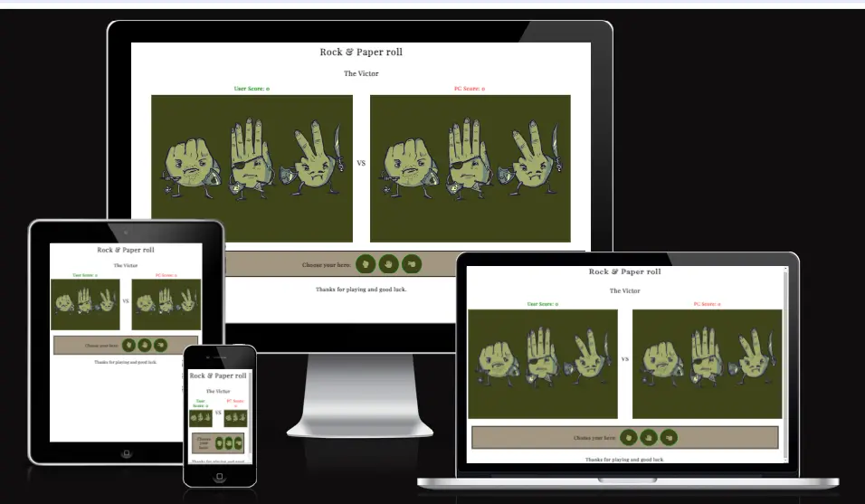
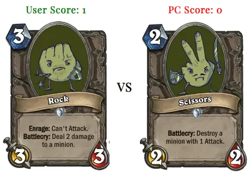
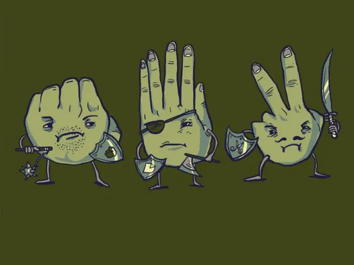
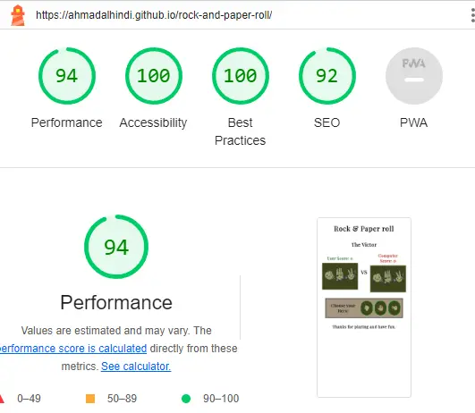

# Rock and Paper roll

Rock and Paper roll is a site with a major consideration of JavaScript achieve. The goal of the site is to entertain the users and give them at the same time the taste of JavaScript concepts. It allows the users to pick their hero: (rock, paper, or scissors) as a challenge against the computer.

## Features

### Existing Features

- **The Header**

  - The name of the site that located at the top to give big attention of what is the site about.

- **The victor area**

  - This area contains a text that elaborates who is the winner and the reason of winning or losing depending on ability of each chosen hero.

- **The score area**

  - This area will count how many times for each the user and the opponent (the computer) win.
  - The color of the winning number for the user will be green and for the opponent will be in red.
  - The area also contains two pictures that represent the chosen hero.

- **The hero select section**

  - This section will allow the user to select the hero as a button.
  - These buttons are represented as icons.
  - Using the hover attribute to ease the selection as double size the button content.

- **The footer**

  - Contains a text to thank the user for playing and the hope for great enjoying.

## Testing

### Validator Testing

- Lighthouse

  - I tested and got the follow result:
    

- HTML
  - No errors were returned when passing through the official [W3C validator](https://validator.w3.org/nu/?doc=https%3A%2F%2Fahmadalhindi.github.io%2Frock-and-paper-roll%2F)
- CSS
  - No errors were found when passing through the official [(Jigsaw) validator](https://jigsaw.w3.org/css-validator/validator?uri=https%3A%2F%2Fahmadalhindi.github.io%2Frock-and-paper-roll%2F&profile=css3svg&usermedium=all&warning=1&vextwarning=&lang=en)
- JavaScript
  - I tested with [Jshint validator](https://jshint.com/) and got 18 warnings:
    - The two warnings that I solved are:
      - Unnecessary semicolon, in the last line in JavaScript: I solve it by removing the semicolon.
      - Expected an assignment or function call and instead saw an expression: I solve it by set return before it.
    - The rest 16 warnings are just repeating for only two warnings (you can open the link to see them) and those normally to create a configuration file in project directory to set up JSHint:
      - 'let' is available in ES6 (use 'esversion: 6') or Mozilla JS extensions (use moz).
      - 'template literal syntax' is only available in ES6 (use 'esversion: 6').

### Unfixed Bugs

- See the Validator Testing paragraph above for JavaScript by JSHint.

### Fixed Bugs

- See the Validator Testing paragraph above for JavaScript by JSHint.

## Deployment

- The site was deployed to GitHub pages. The steps to deploy are as follows:
  - In the GitHub repository, navigate to the Settings tab
  - From the source section drop-down menu, select the Master Branch
  - Once the master branch has been selected, the page will be automatically refreshed with a detailed ribbon display to indicate the successful deployment.

The live link can be found here - https://ahmadalhindi.github.io/rock-and-paper-roll/

## Credits

- The flexbox in CSS as media queries: [css-tricks](https://css-tricks.com/snippets/css/a-guide-to-flexbox/) & [Youtube-Kevin Powell](https://www.youtube.com/@KevinPowell).

- The score area in HTML and the function for playGame in JavaScript: from love math and rock paper scissors by code institute.

### Content

- The text for the Home page was taken from [Google Fonts](https://fonts.google.com/)
- The icons in the buttons were taken from [Font Awesome](https://fontawesome.com/)

### Media

- The images used for Heroes were taken from: https://www.reddit.com/r/customhearthstone/comments/75yn9j/rock_paper_scissors/ and
  https://gopro-forum.ru/hu/chto-takoe-kamen-nozhnicy-bumaga-kak-igrat-v-igru-kamen
